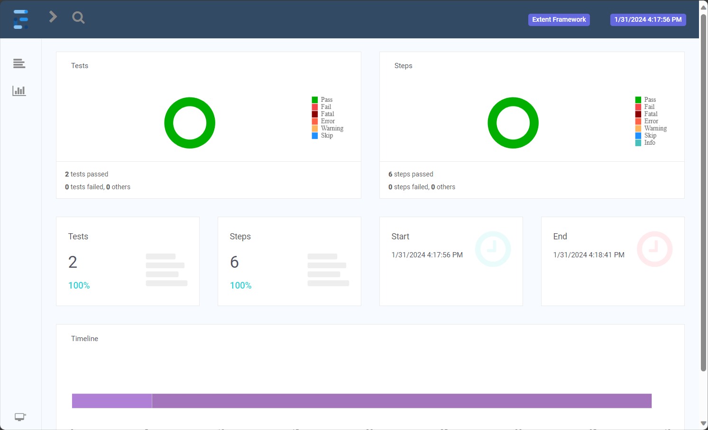
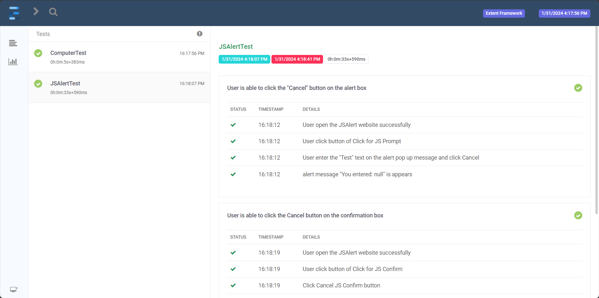
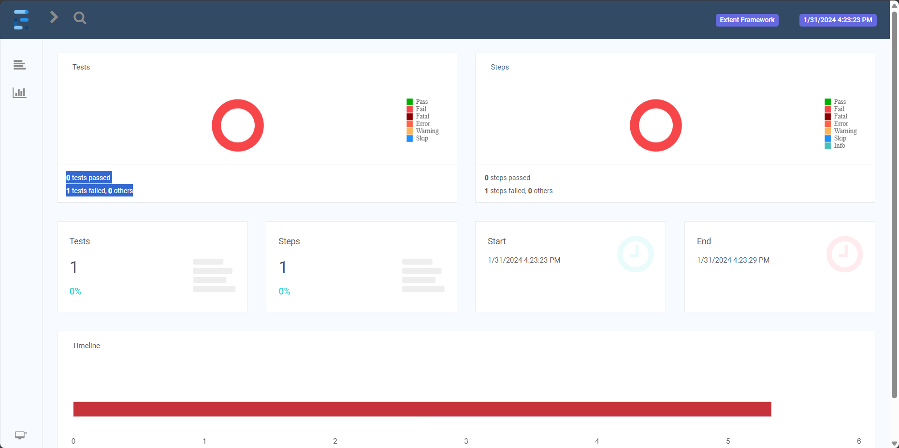
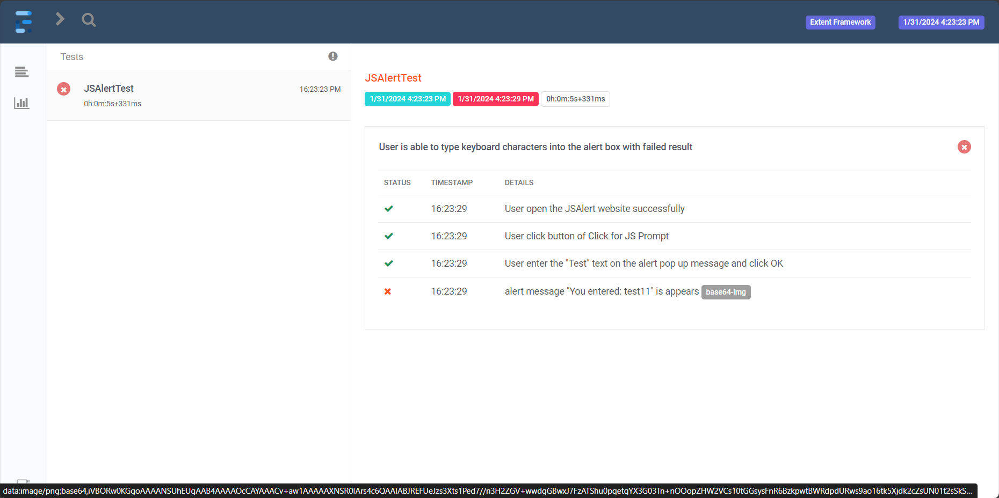
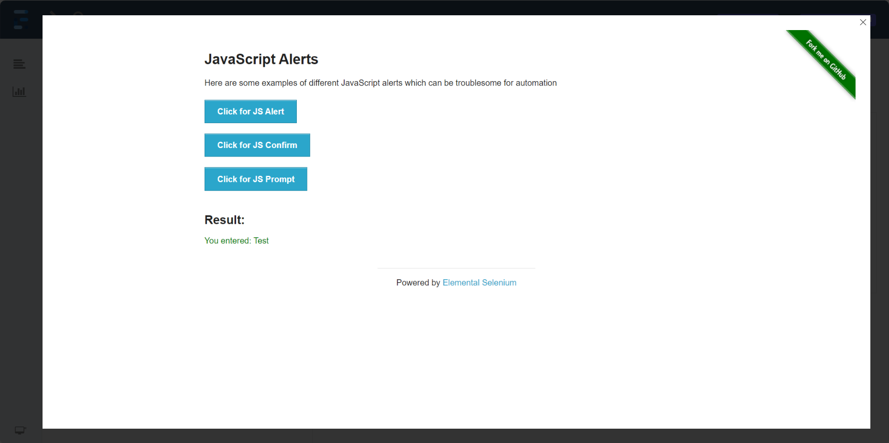

#SpecFlow Selenium Framework 
=========================
### Uses:  
+ SpecFlow (BDD)
+ Selenium (WebDriver)
+ NUnit 2.x
+ Extent Report integration with Specflow and Selenium C#
+ specflow-report-templates (for reporting) 
+ utilises Page Object Model pattern
## 1. Selenium 3.11.1 Page Object Model breaking changes
Selenium 3.11.0 and deprecation of PageFactory class of Page Object Model of Selenium.
https://www.youtube.com/watch?v=jgKgbVcQ-1U

## 2. Extent Report integration with Specflow and Selenium C#
We will create extent report in BDD style using Specflow and Selenium C# with bare minimal code change in our existing code base.

Screenshot for failed test result
